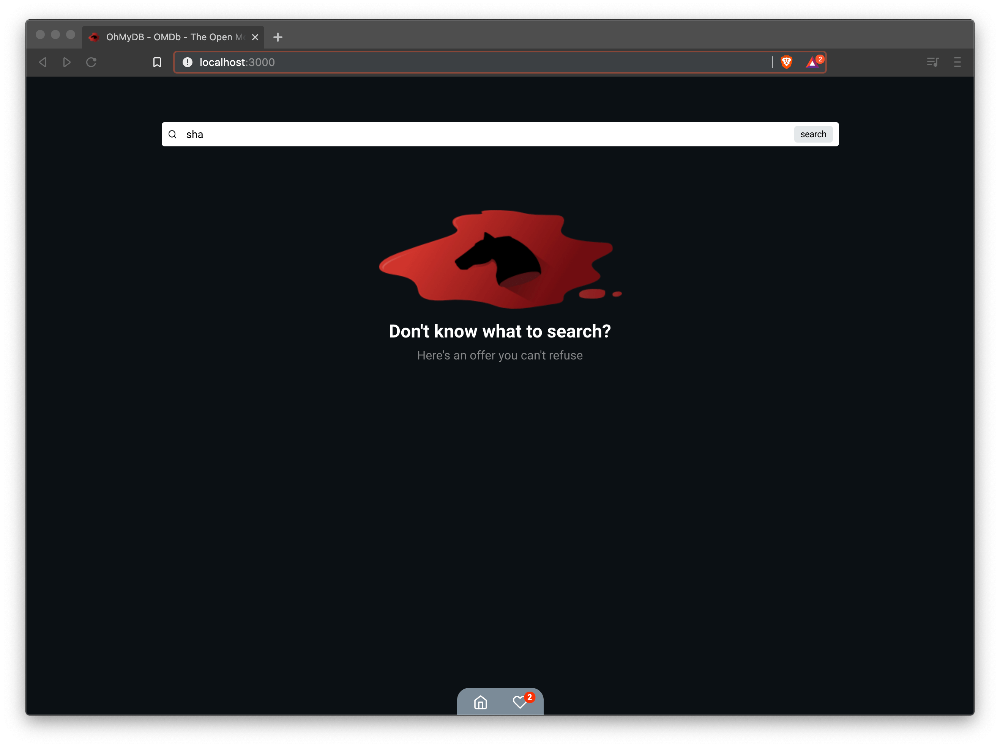
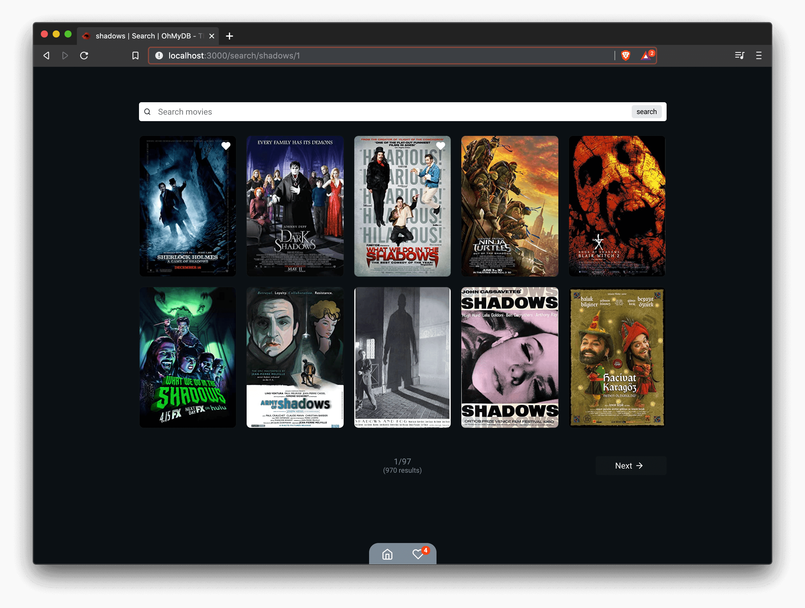
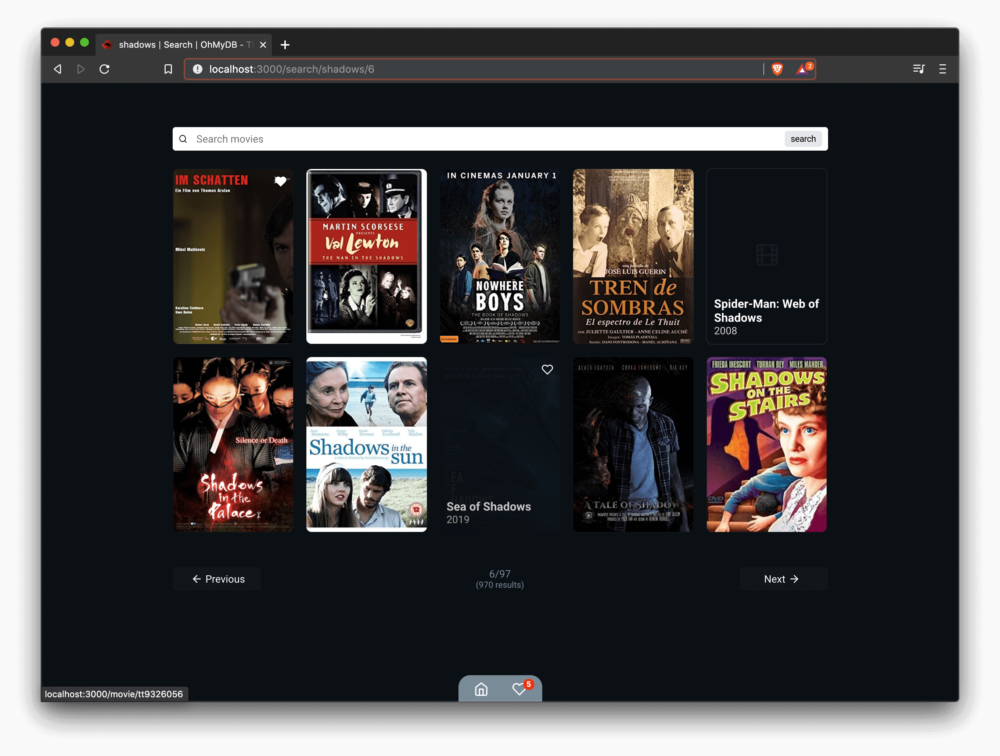
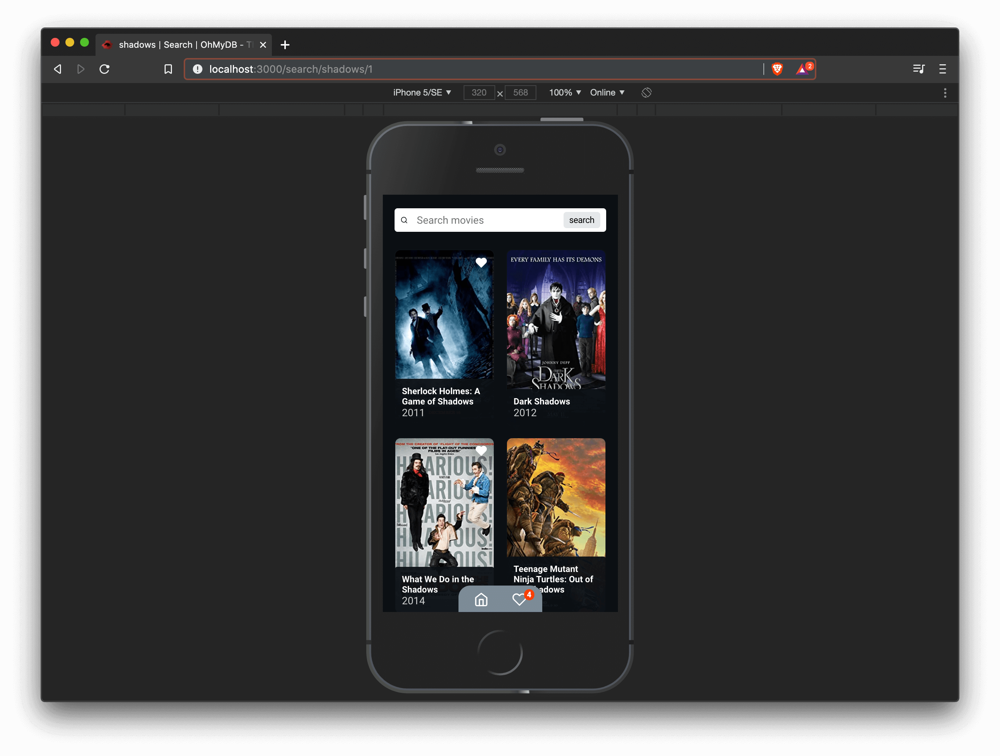
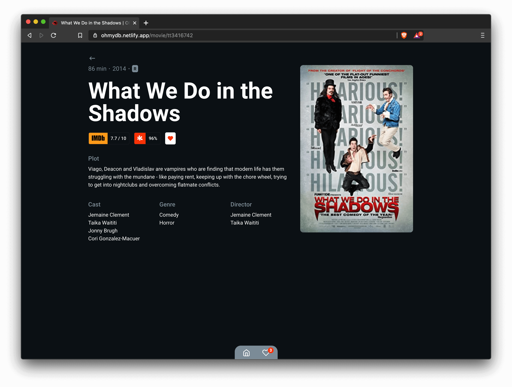
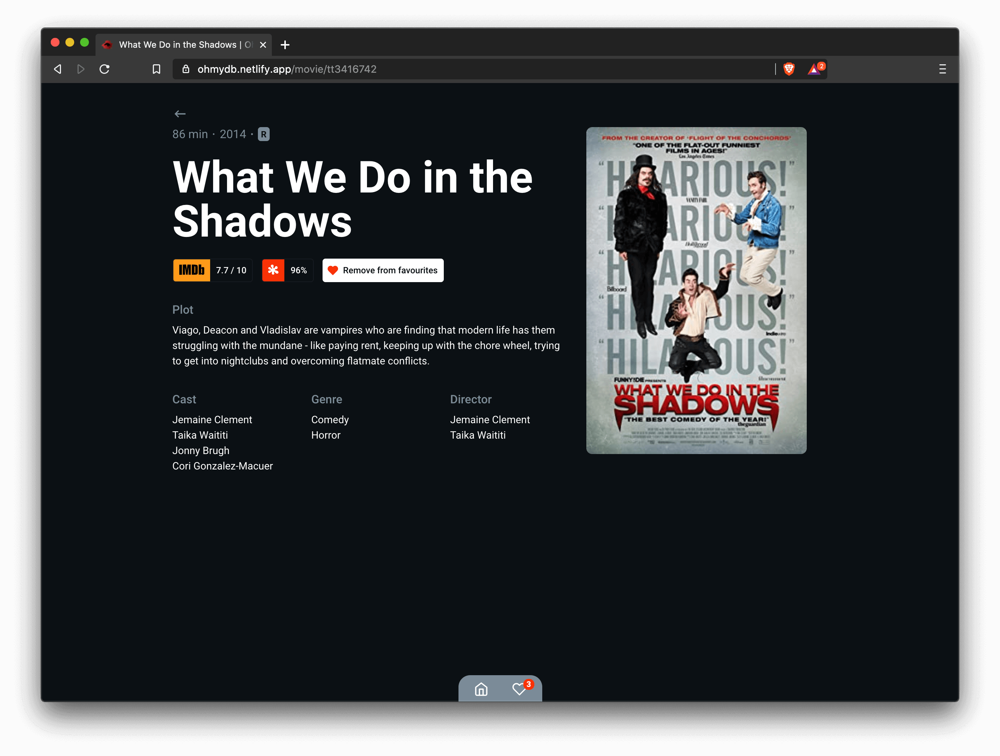
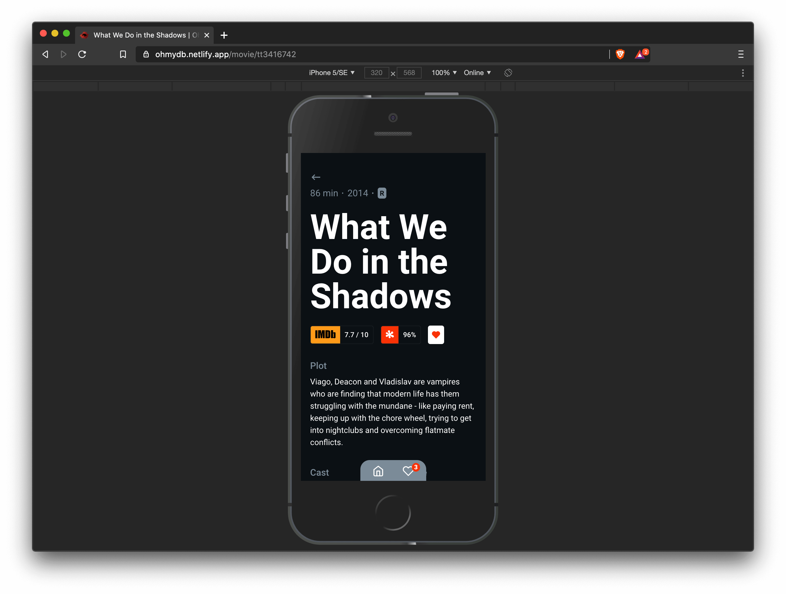
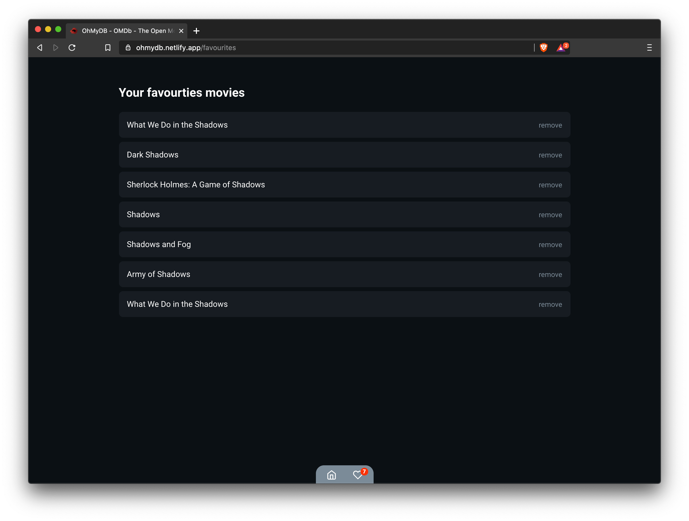

<h1 align="center">


</h1>

<h3 align="center">
  OhMyDB é um app catálogo de filmes e séries que consome a OMDb API - The Open Movie Database. Você pode consultar a sinopse do filme, ver detalhes e salva-lo na sua lista de favoritos
</h3>

# **Instalação**

## `Dependências`

Exexute na pasta do projeto:

```
yarn
```

## `OMDb APi Key`

A OMDb API exige uma API KEY que pode ser gerada [aqui](https://www.omdbapi.com/apikey.aspx).

> Depois de gerada você deve seta-la como variável de ambiente como pode ser visto no _.env.example_. Altere o valor _YOU_API_KEY_ e salve o arquivo como _.env.local_

```
REACT_APP_API_KEY=YOUR_API_KEY
```

# **Frontend**

- Para rodar o projeto execute  
  `yarn start`

  > Com o projero rodando, acesse o app no seu nevegador em http://localhost:3000.

# **SWR**

SWR está sendo usado nas resquisições para otimizar o cache.

# **Testes**

Para testar está sendo usado o Jest com a `@testing-library/react` e o `cypress`.

- Para testar o projeto execute um dos comandos abaixo
  - Testes com o Jest  
    `yarn test`
  - Testes com o Cypress  
    `yarn cypress`  
    `yarn cypress:chrome`  
    `yarn cypress:open`

# **Screenshots**

`Home`

`Search page`

`Search page with hover on item`

`Search page on mobile`

`Movie page`

`Movie page - favourite`

`Movie page - favourite hover`

`Movie page on mobile`

`Favourite page`

